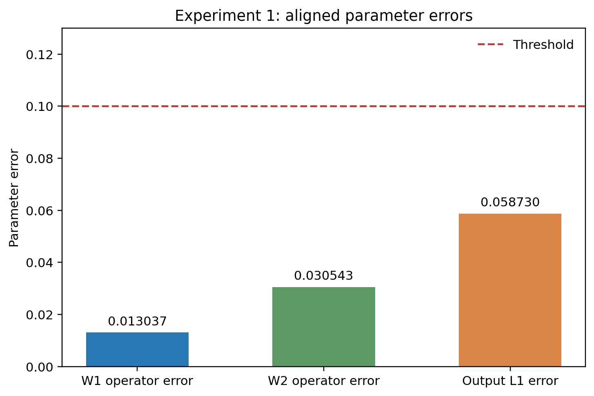
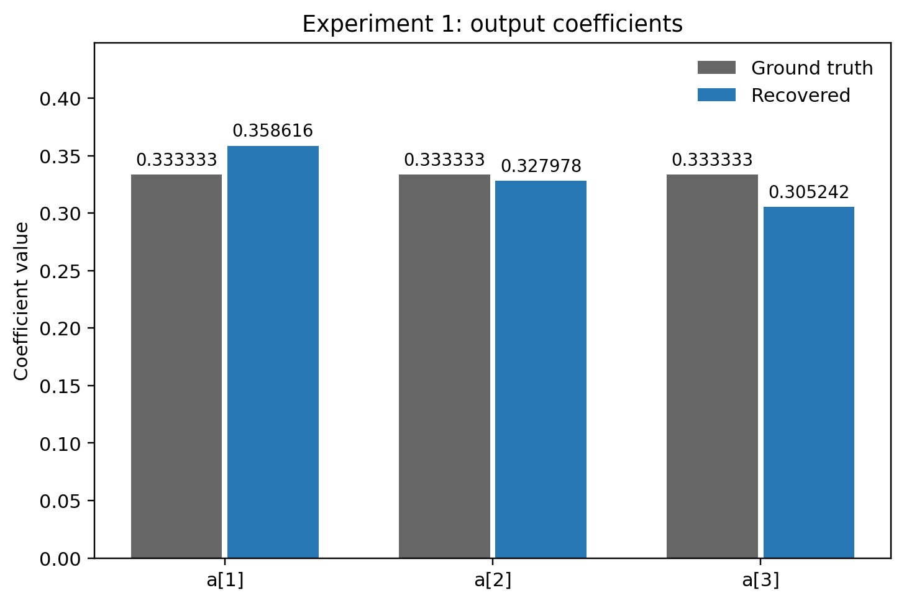

# ASPIRE

## Experiment 1: layerwise parameter recovery

This experiment recovers the parameters of a fixed polynomial network with architecture **8 → 3 → 3 → 1** and activation $z\mapsto z^4$, using noiseless real-valued function queries.

The first hidden layer uses column-space recovery and ASPIRE gradient moments. The second hidden layer uses measured Hessians and symmetric generalized eigendecomposition. The output coefficients are fitted by ordinary least squares on standard Gaussian inputs.

## Installation

```bash
git clone https://github.com/JinqiSMS/aspire.git
cd aspire
conda env create -f environment.yml
conda activate aspire
```

The environment is named `aspire` and uses Python 3.10. Dependencies are pinned in `requirements-lock.txt`; the numerical versions are NumPy 1.26.4 and SciPy 1.13.1. This experiment runs on a CPU.

If the environment already exists:

```bash
conda activate aspire
python -c "import sys; assert sys.version_info[:2] == (3, 10)"
python -m pip install -r requirements-lock.txt
```

## Run the experiment

Run from the repository root:

```bash
python run_experiment.py
```

This estimates all three parameter blocks and writes the output to `results/experiment_01/`. It prints the recovered matrices, ground-truth matrices, and their differences in the terminal, and saves three Matplotlib figures as PNG and PDF.

To use the supplied first-layer estimate and run the Hessian and regression stages:

```bash
python run_experiment.py --use-first-layer-checkpoint
```

This writes to `results/experiment_01_checkpoint/`. The first-layer source and the number of new function queries are recorded explicitly. The files in [examples/experiment_01](examples/experiment_01/) were generated with this command using the stored first layer from a completed full sampling run.

Completed first layers are saved in the output directory and reused on subsequent runs. For a fresh full execution, specify a new directory:

```bash
python run_experiment.py --output results/experiment_01_run2
```

Changing the configuration or source version also requires a new output directory. An interruption during first-layer sampling restarts that layer.

## Configuration and random seeds

The complete configuration is in [configs/experiment_01.yaml](configs/experiment_01.yaml).

- First layer: **16,777,216 independent chains, 32 steps per chain**, batch size 4,096; algorithm seed `3141116543`.
- Second layer: one anchor Hessian and 12 probe Hessians, 64 random mixtures; direction seed `431061063`, mixture seed `2356887966`.
- Held-out Hessians: six probes; seed `2828169828`.
- Output regression: **1,048,576** inputs sampled from $\mathcal N(0,I_8)$; seed `1586144878`.
- Prediction evaluation: 20,000 angular directions; seed `1444349591`.

Each stage uses its own `numpy.random.default_rng(seed)`. The entry point fixes numerical-library thread counts to one. The fixed target arrays and optional first-layer checkpoint are stored in `data/experiment_01/` and checked by SHA-256. Batch size is part of the first-layer random-number layout.

## Recorded parameter values and errors

The result for this target and these random streams is:

```text
First-layer operator error     0.01303729
Second-layer operator error    0.03054302
Output coefficient L1 error    0.05872970
Output coefficient L1 norm     0.99183571
```

The aligned output coefficients are approximately

$$
\widehat a=(0.3586160344,\;0.3279780697,\;0.3052416023),
\qquad a=(1/3,\;1/3,\;1/3).
$$

The complete values of $W_1$, $W_2$, and $a$ are in [weights.txt](examples/experiment_01/weights.txt), with every coordinate also available in [weights.csv](examples/experiment_01/weights.csv). Comparison uses sequential hidden-unit permutation alignment and first-layer sign alignment. Raw estimates remain available in JSON and NPZ. Floating-point results can differ slightly between numerical-library builds.





The [weight comparison figure](examples/experiment_01/figures/weight_comparison.png) shows all ground-truth entries, aligned estimates, and signed differences. PDF versions are saved beside the PNG files.

## Output files

```text
results/experiment_01/
  run.json                  # Configuration, source hash, environment, and timing
  metrics.json              # Parameter errors and numerical diagnostics
  queries.json              # Stage costs and current-execution query totals
  first_layer.npz           # Completed first-layer parameters
  first_layer.json          # First-layer sampling settings and query ledger
  weights.txt               # Readable ground truth, aligned estimates, differences
  weights.csv               # One row per parameter coordinate
  weights.json              # Ground truth, raw estimates, aligned estimates, errors
  weights.npz               # The same parameter arrays at full numerical precision
  figures/
    weight_comparison.png   # Full parameter comparison; PDF also saved
    parameter_errors.png    # Layerwise errors; PDF also saved
    output_coefficients.png # Output coefficient values; PDF also saved
```

JSON and NPZ retain full floating-point values; figures use rounded annotations. To inspect the arrays directly:

```python
import numpy as np
weights = np.load("results/experiment_01/weights.npz")
print(weights["W1_true"])
print(weights["W1_aligned"])
print(weights["W2_aligned"])
print(weights["a_aligned"])
```

Draw the figures again from saved parameters:

```bash
python run_experiment.py --figures-only --output results/experiment_01
```

## Query costs and runtime

```text
Column-space recovery                     2,176
Hit-and-Run membership            31,138,512,896
Gradient moments                    855,638,016
First-layer total                31,994,153,088
Training Hessians                          390
Gaussian training labels             1,048,576
Total learning queries           31,995,202,054
```

Held-out Hessians add 180 queries and prediction evaluation adds 20,000. The `--use-first-layer-checkpoint` command makes **1,069,146 new queries** in total; the saved first-layer cost is reported separately.

On an Intel Core i5-13500H with Python 3.10.21 and one numerical-library thread, the first-layer stage took **57.91 minutes**. Allow approximately **one hour** for the full command and several GiB of free RAM. With the stored first layer, the remaining computation and figure export take roughly **5-10 seconds**. These timings exclude environment installation and vary with hardware and system load.

## Tests and source layout

```bash
python -m pytest tests -q --basetemp tmp/pytest
python scripts/check_experiment.py results/experiment_01_checkpoint
```

The second command checks the output of the checkpoint command above. GitHub Actions runs the numerical tests and this experiment on Linux and Windows.

See [docs/algorithm.md](docs/algorithm.md) for the mathematical operations and [docs/modules.md](docs/modules.md) for the code map. Source code, comments, configuration, output labels, and documentation use English.
