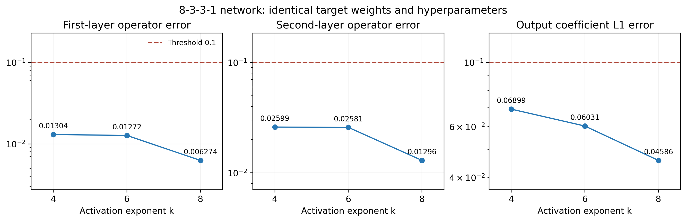
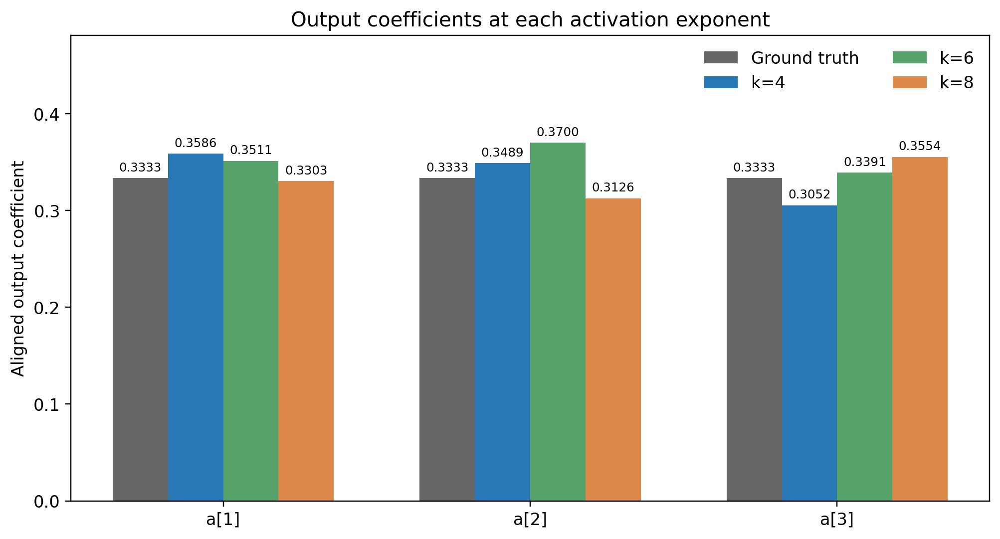
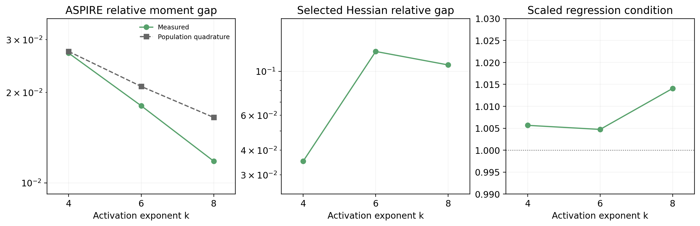

# Activation exponent comparison

The architecture is 8-3-3-1. Target weight matrices, coefficients, random seeds, and all numerical hyperparameters are fixed; only the activation exponent changes.

Each exponent has its own first-layer estimate. The origins and any imported sources are recorded below. Saved first-layer sampling times and costs refer to the original computations, while current execution counts describe this run.

## Full-run commands

These commands start new complete experiments; existing results require a different --output directory.

```bash
python run_experiment.py --config configs/experiment_k4.yaml --output results/activation_comparison/k4
python run_experiment.py --config configs/experiment_k6.yaml --output results/activation_comparison/k6
python run_experiment.py --config configs/experiment_k8.yaml --output results/activation_comparison/k8
python scripts/summarize_activation.py --output examples/activation_comparison
```

## Fixed settings

- Target: identical $W_1$, $W_2$, and $a=(1/3,1/3,1/3)$ for all exponents; noiseless value queries.
- First layer: 16,777,216 independent chains, 32 transitions per chain, batch size 4,096, and 16 column-space probes.
- First-layer oracle: original directional step 0.25; reduced-gradient step factor 0.5; bisection absolute tolerance $10^{-7}$ and at most 100 iterations.
- Public bounds: $\kappa_0=2$ and $\mu=0.25$; first-layer limits are 40 billion queries and 14,400 seconds.
- Second layer: one anchor plus 12 probe Hessians, 64 random mixtures, six held-out probes, $\tau=0.2$, and interpolation step 0.1.
- Output layer: ordinary least squares on 1,048,576 standard Gaussian inputs, batch size 65,536.
- Evaluation: 20,000 angular directions; each hidden-layer operator error and output coefficient L1 error must be at most 0.1 to pass.
- Seeds: first layer 3141116543; Hessian directions 431061063; mixtures 2356887966; held-out Hessians 2828169828; regression 1586144878; evaluation 1444349591.

The total network degree is $k^2$: 16, 36, and 64. Degree-dependent interpolation node counts and radius bounds follow the same algorithm for each exponent.

The corrected second-layer normalization is $\widehat w_j=|v_j|/(\mathbf{1}^\top|v_j|)$, with coordinatewise absolute values. It enforces nonnegative entries and unit column sums. Output coefficients are refitted by unconstrained OLS after normalization.

Errors use hidden-unit permutation alignment and first-layer sign alignment. The reported output error is $\|\widehat a-a\|_1$, distinct from the coefficient norm $\|\widehat a\|_1$.

## Results

### k=4

Status: complete; parameter threshold passed: True.

- first_layer_error: 0.013037289900738625
- second_layer_error: 0.025987360701509123
- output_l1_error: 0.0689854416538877
- coefficient_l1_norm: 1.012800593018873
- normalization: coordinatewise_absolute_value_and_l1
- minimum_weight_entry: 0.0076970282614753464
- negative_weight_entries: 0
- first_layer_origin: imported_first_layer
- first_layer_source: archive/activation_signed_normalization/k4
- new_first_layer_queries: 0
- moment_gap: 0.02705140701727568
- population_moment_gap: 0.027402173312796468
- hessian_relative_gap: 0.03518084503520246
- regression_condition: 1.0056670605026308
- max_leverage: 0.8614729068286158
- max_label_energy_share: 0.7150182484237612
- computation_seconds: 0.8107721999986097
- first_layer_sampling_seconds: 3474.8625474
- hessian_seconds: 0.054869700004928745
- regression_seconds: 0.3604330999951344
- complete_learning_queries: 31995202054
- current_execution_queries: 1069146

Aligned output coefficients: `[0.35861531118  0.348944372823 0.305240909016]`.

Individual metrics and any recovered weight comparisons are in `k4/`.

### k=6

Status: complete; parameter threshold passed: True.

- first_layer_error: 0.01271764985824841
- second_layer_error: 0.02581270499876755
- output_l1_error: 0.06030532347088413
- coefficient_l1_norm: 1.0603053234708841
- normalization: coordinatewise_absolute_value_and_l1
- minimum_weight_entry: 0.014808400084648331
- negative_weight_entries: 0
- first_layer_origin: imported_first_layer
- first_layer_source: archive/activation_signed_normalization/k6
- new_first_layer_queries: 0
- moment_gap: 0.018062071839840457
- population_moment_gap: 0.020952826147105228
- hessian_relative_gap: 0.12603868271280766
- regression_condition: 1.0047354757898863
- max_leverage: 0.9945994788105927
- max_label_energy_share: 0.9937801818015328
- computation_seconds: 0.8819604000018444
- first_layer_sampling_seconds: 3341.1416773999954
- hessian_seconds: 0.07490830001188442
- regression_seconds: 0.4116703000036068
- complete_learning_queries: 33001837730
- current_execution_queries: 1069374

Aligned output coefficients: `[0.351132884328 0.370039866279 0.339132572864]`.

Individual metrics and any recovered weight comparisons are in `k6/`.

### k=8

Status: complete; parameter threshold passed: True.

- first_layer_error: 0.006274294989731217
- second_layer_error: 0.012961563323356512
- output_l1_error: 0.04586131615343614
- coefficient_l1_norm: 0.9982374499768359
- normalization: coordinatewise_absolute_value_and_l1
- minimum_weight_entry: 0.002499220905772944
- negative_weight_entries: 0
- first_layer_origin: imported_first_layer
- first_layer_source: archive/activation_signed_normalization/k8
- new_first_layer_queries: 0
- moment_gap: 0.011807840305310827
- population_moment_gap: 0.016517869527149866
- hessian_relative_gap: 0.10774117694369693
- regression_condition: 1.0140765656669999
- max_leverage: 0.9999579736511386
- max_label_energy_share: 0.9999449357201889
- computation_seconds: 0.9128280000004452
- first_layer_sampling_seconds: 3430.734167799994
- hessian_seconds: 0.0980445999884978
- regression_seconds: 0.4005559999932302
- complete_learning_queries: 33337385790
- current_execution_queries: 1069602

Aligned output coefficients: `[0.330279838026 0.312574895553 0.355382716398]`.

Individual metrics and any recovered weight comparisons are in `k8/`.

## Figures







The separate column-space diagnostic uses analytic gradients for evaluator-side comparison only; it does not supply derivatives or parameters to the learner. Its queries are recorded separately in column_diagnostics.json.

Population moment gaps use deterministic sphere quadrature and analytic radial integration. Grid convergence is recorded in population_moments.json when that optional diagnostic has been generated. These diagnostics are not used by the learning algorithm.

The batch value oracle evaluates even powers by multiplication chains, verified against general exponentiation. Original first-layer costs and current execution queries are reported separately above.
