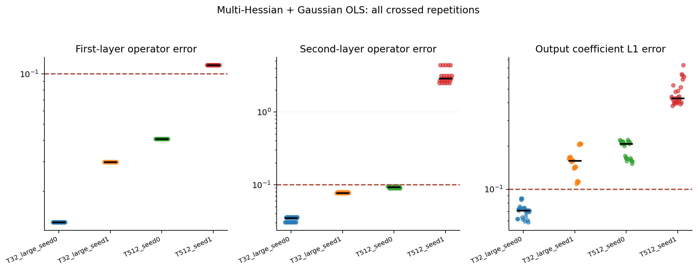
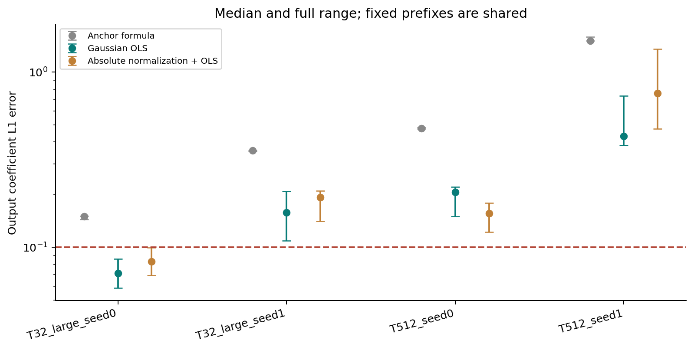
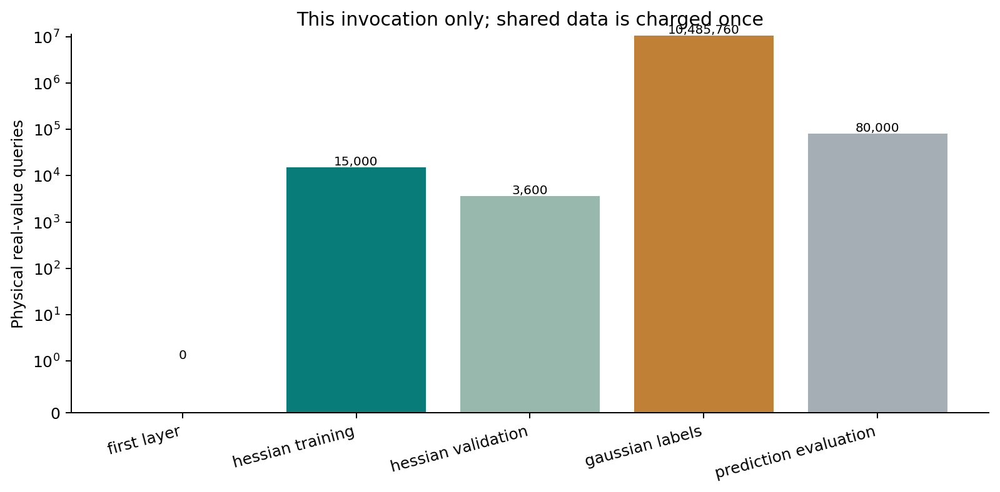
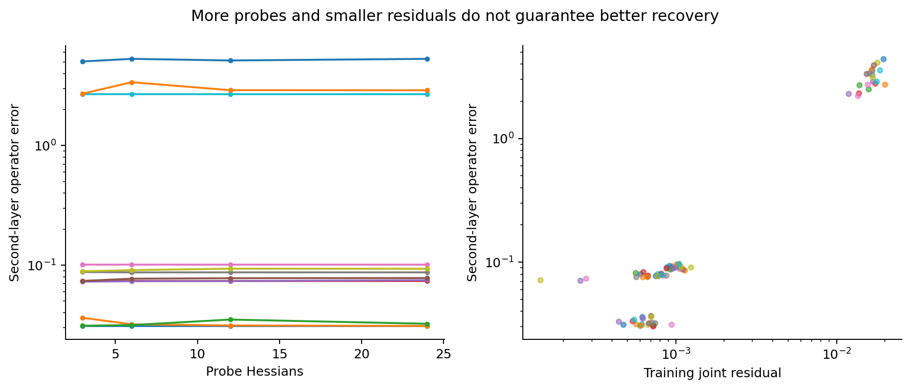

# ASPIRE reproduction results

Mode: checkpoint; preset: study; 560 records; computation time 118.49 seconds. Fresh physical queries: 10,584,360.

[Offline report](index.html) | [CSV records](records.csv) | [Group summaries](summary.json)

## Main output regression results

- **T32_large_seed0**: 25/25 passed; output L1 error median 0.07112770, range [0.05872970, 0.08604529].
- **T32_large_seed1**: 0/25 passed; output L1 error median 0.15844016, range [0.10910173, 0.20905262].
- **T512_seed0**: 0/25 passed; output L1 error median 0.20709490, range [0.15046519, 0.22117799].
- **T512_seed1**: 0/25 passed; output L1 error median 0.43096479, range [0.38286954, 0.73426621].

Crossed repeats share a first-layer estimate. The best prefix is one locally successful setting; the other historical prefixes do not meet the same full-network threshold. Negative signed weights are reported explicitly.

