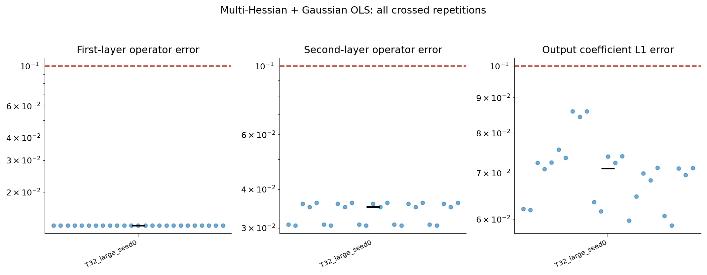
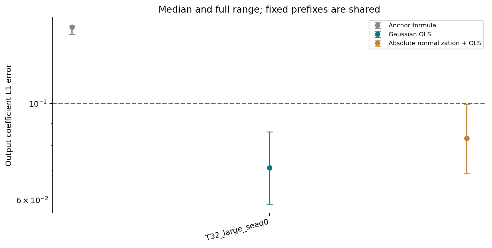
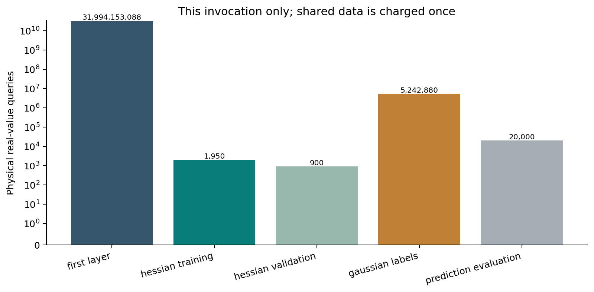
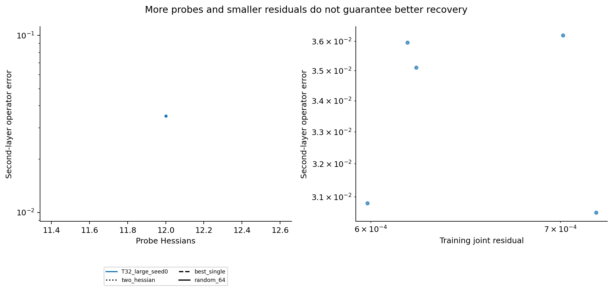

# ASPIRE reproduction results

Mode: full; preset: best; 55 records; computation time 3501.31 seconds. Fresh physical queries: 31,999,418,818.

[Offline report](index.html) | [CSV records](records.csv) | [Group summaries](summary.json)

## Main output regression results

- **T32_large_seed0**: 25/25 passed; output L1 error median 0.07112770, range [0.05872970, 0.08604529].

Crossed repeats share a first-layer estimate. The best prefix is one locally successful setting; the other historical prefixes do not meet the same full-network threshold. Negative signed weights are reported explicitly.

